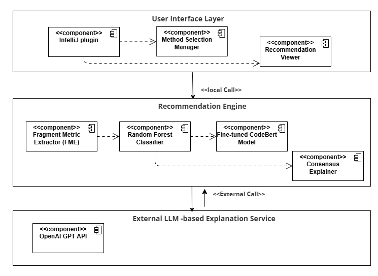

# Xtract

## AI-based Explainable Extract Method Recommendation for IntelliJ IDEA

Xtract is an IntelliJ IDEA plugin that recommends **Extract Method**
refactorings using Artificial Intelligence (AI), Explainable AI (XAI), and
Large Language Models (LLMs).

Unlike traditional recommendation tools that only identify potential
refactoring opportunities, Xtract provides **complete recommendations**
following the **W3B criterion (Which, Where, Why, and Benefits)**.

---

## 📑 Table of Contents

- Overview
- Features
- Demonstration
- Architecture
- Installation & Setup
- Citation
- License

---

# Overview

Software systems continuously evolve, increasing their structural complexity and
making refactoring an essential activity for maintaining software quality.

Although several automated refactoring recommendation tools have been proposed,
most of them generate incomplete recommendations, making it difficult for
developers to understand, trust, and adopt the suggested refactorings.

Xtract addresses this problem by combining Machine Learning,
Explainable Artificial Intelligence, and Large Language Models to recommend
**Extract Method** refactorings directly inside IntelliJ IDEA.

The recommendation follows the **W3B criterion**, informing developers:

✔ Which refactoring should be applied

✔ Where it should be applied

✔ Why it is recommended

✔ Which benefits are expected

> **Note**
> The current plugin interface displays the Which, Where and Why
> dimensions. The Benefits dimension is already supported by the
> recommendation engine but is not yet exposed in the graphical interface.

# Key Features

- IntelliJ IDEA plugin fully integrated into the IDE.
- Automatic recommendation of **Extract Method** refactorings.
- Method classification using a trained **Random Forest** model.
- Candidate fragment ranking using a **fine-tuned CodeBERT** model.
- Explainable predictions based on Explainable AI (XAI).
- Consensus-based explanation generated from multiple explanation techniques.
- Natural language explanations generated using GPT.
- Recommendations organized according to the **W3B criterion**.

---

# Demonstration

A demonstration video showing the installation, execution, and recommendation process of **Xtract** is available on Zenodo.

🎥 **Demonstration Video**

https://doi.org/10.5281/zenodo.21459888

The video illustrates:

- Plugin installation;
- Selection of a Java method;
- Execution of the recommendation process;
- Visualization of the recommended code fragment;
- Explanation generated by Xtract.

---

# Architecture

The architecture of **Xtract** is organized into three modular layers that separate user interaction, recommendation generation, and natural language explanation.

The **User Interface** layer integrates Xtract into IntelliJ IDEA, allowing developers to request recommendations directly from the IDE. The **Recommendation Engine** orchestrates the recommendation process by extracting software metrics, identifying candidate fragments, applying Machine Learning models, and generating explainable predictions. Finally, the **LLM-based Explanation Service** synthesizes the outputs of previous stages into natural language recommendations following the W3B criterion.

---
# Installation & Setup

---

# License

This project is licensed under the **MIT License**.

See the [LICENSE](LICENSE) file for complete license information.

---
